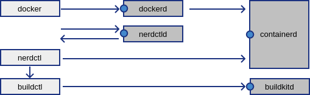

# nerdctld


This is a daemon offering a `nerdctl.sock` endpoint.

It can be used with `DOCKER_HOST=unix://nerdctl.sock`.

| :exclamation: Currently it mostly handles the images, for containerd k8s clusters. |
|----------------------------------------------------------------------------------- |
| There is some limited information about version and info, containers and volumes.  |

Normally the `nerdctl` tool is a CLI-only application.

A client for the `containerd` and `buildkitd` servers.

<https://github.com/containerd/nerdctl>

<https://github.com/docker/cli> `docker`

## Docker API

The Docker API (REST) is available at:

<https://docs.docker.com/engine/api/>

Docker version | API version
--- | ---
24.0 | 1.43
23.0 | 1.42
... | ...
20.10 | 1.41
19.03 | 1.40
18.09 | 1.39
... | ...
17.03 | 1.26
1.13 | 1.25
1.12 | 1.24

## Diagram



* `docker.sock`
* `nerdctl.sock`
* `containerd.sock`
* `buildkit.sock`

## Debugging

To start the nerdctl daemon in debugging mode:

```shell
./nerdctld --debug
```

In another shell, you can communicate with it:

```shell
DOCKER_HOST=unix://nerdctl.sock docker version
```

You can use cURL for talking HTTP to a Unix socket:

`curl --unix-socket /var/run/docker.sock http://localhost:2375/_ping`

This can be useful to see what happens under the hood.

Note: replace the socket path, with the one you want.

## Running daemon

### user containerd

```console
$ nerdctl version
...
```

`systemctl --user start nerdctl.socket`

```shell
DOCKER_HOST=unix://$XDG_RUNTIME_DIR/nerdctl.sock docker version
```

### system containerd

```console
$ sudo nerdctl version
...
```

`sudo systemctl --system start nerdctl.socket`

```shell
sudo DOCKER_HOST=unix:///var/run/nerdctl.sock docker version
```

If you wanted to grant all users in the group "nerdctl" access:

/etc/systemd/system/nerdctl.socket.d/10-group.conf

```desktop
[Socket]
UMask=0007
Group=nerdctl
```

This would allow access without using `sudo` (or being `root`).

#### **Warning**

This `nerdctl` group grants privileges equivalent to the `root` user.

Compare with the `docker` group for the docker daemon (`dockerd`):

<https://docs.docker.com/engine/security/#docker-daemon-attack-surface>

To run nerdctl without root privileges, see rootless (user) mode above.

## Kubernetes

In order to see the Kubernetes containers and images,
you will need to change the containerd "namespace":

/etc/systemd/system/nerdctl.service.d/10-namespace.conf

```desktop
[Service]
Environment=CONTAINERD_NAMESPACE=k8s.io
```

You could also use the Kubernetes tool called `crictl`,
and configure it to talk to the "containerd" runtime:

/etc/crictl.yaml

```yaml
runtime-endpoint: unix:///run/containerd/containerd.sock
```

<https://github.com/kubernetes-sigs/cri-tools>

One difference is that nerdctl shows the repo digest as ID,
whereas `crictl images` shows the image ID as the image ID:

```
REPOSITORY                                 TAG        IMAGE ID        CREATED              PLATFORM       SIZE         BLOB SIZE
registry.k8s.io/pause                      3.8        900118502363    About an hour ago    linux/amd64    700.0 KiB    304.0 KiB
registry.k8s.io/pause                      <none>     900118502363    About an hour ago    linux/amd64    700.0 KiB    304.0 KiB
registry.k8s.io/kube-apiserver             v1.25.1    4f261d18da8d    About an hour ago    linux/amd64    125.5 MiB    32.6 MiB
registry.k8s.io/kube-apiserver             <none>     4f261d18da8d    About an hour ago    linux/amd64    125.5 MiB    32.6 MiB
```

```
IMAGE                                     TAG                 IMAGE ID            SIZE
registry.k8s.io/pause                     3.8                 4873874c08efc       311kB
registry.k8s.io/kube-apiserver            v1.25.1             b09a3dc327be2       34.2MB
```

Another difference is that nerdctl shows "pause" containers,
but these sandbox images are hidden in `crictl ps` output:

```
CONTAINER ID    IMAGE                                              COMMAND                   CREATED              STATUS    PORTS    NAMES
669b48948f93    registry.k8s.io/pause:3.8                          "/pause"                  About an hour ago    Up                 k8s://kube-system/kube-apiserver-lima-k8s
8b960604e6d2    registry.k8s.io/kube-apiserver:v1.25.1             "kube-apiserver --ad…"    About an hour ago    Up                 k8s://kube-system/kube-apiserver-lima-k8s/kube-apiserver
```

```
CONTAINER           IMAGE               CREATED             STATE               NAME                      ATTEMPT             POD ID              POD
8b960604e6d29       b09a3dc327be2       About an hour ago   Running             kube-apiserver            0                   669b48948f931       kube-apiserver-lima-k8s
```

### Using nerdctld with kind

When using `kind`, it is possible to mount the API socket.
But it is hard to do it as a regular file, when starting.

What usually happens is that "nerdctl.sock" becomes a dir,
and then it fails to mount the unix socket (file) over it.

Workaround: Create a subdirectory, to host the socket:

```desktop
[Socket]
ListenStream=%t/nerdctl/nerdctl.sock
```

And then you can mount this directory, in the kind.yaml:

```yaml
kind: Cluster
apiVersion: kind.x-k8s.io/v1alpha4
nodes:
- role: control-plane
  extraMounts:
  - hostPath: /tmp/nerdctl
    containerPath: /run/nerdctl
```

Then it can be accessed from the host, using the path:

```bash
export DOCKER_HOST=unix:///tmp/nerdctl/nerdctl.sock
```

Make sure to change to the `k8s.io` namespace, see above.
And to use `DOCKER_BUILDKIT=0` (ironically), if building.

You probably also want to use the "containerd" worker:

/etc/buildkit/buildkitd.toml

```toml
[worker.oci]
  enabled = false
[worker.containerd]
  enabled = true
  namespace = "k8s.io"
```

So that your image is instantly available, without loading.

Note: You _have_ to add a registry prefix, for Kubernetes.

```bash
DOCKER_BUILDKIT=0 docker build -t docker.io/myimage .
```

Otherwise, it will not be able to find your image later...

### Using nerdctld with k3s

The containerd socket is available in a different path:

```shell
CONTAINERD_ADDRESS=unix:///run/k3s/containerd/containerd.sock
```

## Remote socket

Calling the socket over `ssh:` requires a program:

`docker system dial-stdio`

It is possible to replace it with a small wrapper:

`socat - nerdctl.sock`

But the feature is **not** available in `nerdctl` (yet):

```
FATA[0000] unknown subcommand "dial-stdio" for "system"
```

And the ssh command has been hardcoded to call "docker":

```go
sp.Args("docker", "system", "dial-stdio")
```

Included is a small `nerdctl` shell wrapper for `docker`.

It will forward `docker`, to `nerdctl` or `nerdctl.sock`.

Make sure to set the DOCKER_HOST variable, for the user:

~/.bashrc

```bash
export DOCKER_HOST=unix:///var/run/nerdctl.sock
```

Or the rootless socket, see above for details.

## Implementation

This program uses the "Gin" web framework for HTTP.

It and docs can be found at <https://gin-gonic.com/> with some nice [examples](https://github.com/gin-gonic/examples)

## Not to be implemented

* buildx*     Docker Buildx
* compose*    Docker Compose
* node        Manage Swarm nodes
* swarm       Manage Swarm

## Implemented commands

* version
* info (system info)
* ps (container ls)
* inspect (container inspect)
* images (image ls)
* inspect (image inspect)
* history (image history)
* load (image load)
* pull (image pull)
* push (image push)
* rmi (image rm)
* save (image save)
* tag (image tag)
* volume ls
* volume inspect
* build

Note: using "build" requires the `buildctl` client.

It also requires a running moby `buildkitd` server.

* <https://github.com/containerd/containerd>

* <https://github.com/moby/buildkit>
