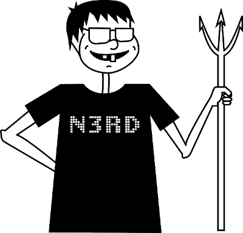

# nerdctld

This is a daemon offering a `nerdctl.sock` endpoint.

It can be used with `DOCKER_HOST=unix://nerdctl.sock`.

Normally the `nerdctl` tool is a CLI-only application.

A client for the `containerd` and `buildkitd` servers.

## Docker API

The Docker API (REST) is available at:

<https://docs.docker.com/engine/api/>

## Debugging

You can use cURL for talking HTTP to a Unix socket:

`curl --unix-socket /var/run/docker.sock http://localhost:2375/_ping`

## Implementation

This program uses the "Gin" web framework for HTTP.

It and docs can be found at <https://gin-gonic.com/> with some nice [examples](https://github.com/gin-gonic/examples)

## Implemented commands

* version
* info (system info)
* images (image ls)
* load (image load)
* pull (image pull)
* ps (container ls)
* save (image save)
* build
